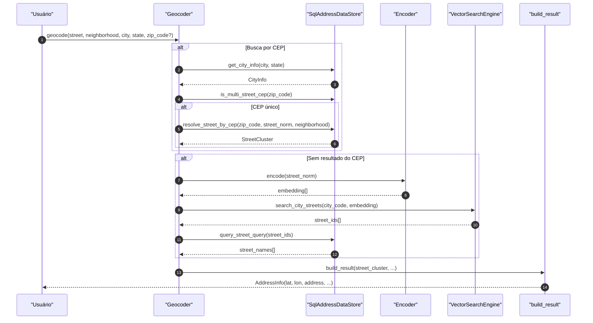
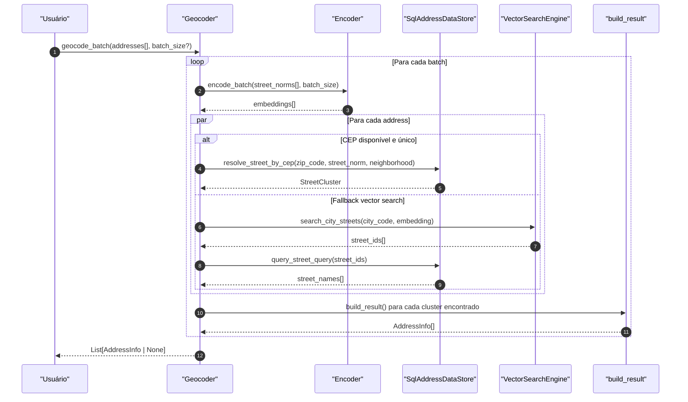
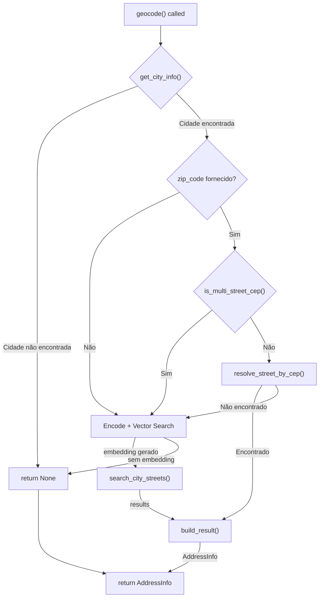

# Geocoder Flow

Sequência de execução do `Geocoder.geocode()` e `Geocoder.geocode_batch()`.

## geocode() - Fluxo Principal

## geocode_batch() - Fluxo em Lote

## Fluxo de Decisão

## Componentes Envolvidos

| Componente | Responsabilidade |
|-----------|-------------------|
| `Geocoder` | Orquestra o fluxo de geocodificação |
| `Encoder` | Gera embeddings de texto (PyTorch/ONNX) |
| `SqlAddressDataStore` | Acesso ao banco SQLite de endereços |
| `VectorSearchEngine` | Busca por similaridade (usearch) |
| `build_result` | Monta o AddressInfo final |
| `get_city_info` | Busca info de cidade por nome/estado |
| `resolve_street_by_cep` | Resolve rua a partir do CEP |
| `search_by_embedding` | Busca por embedding vetorial |
