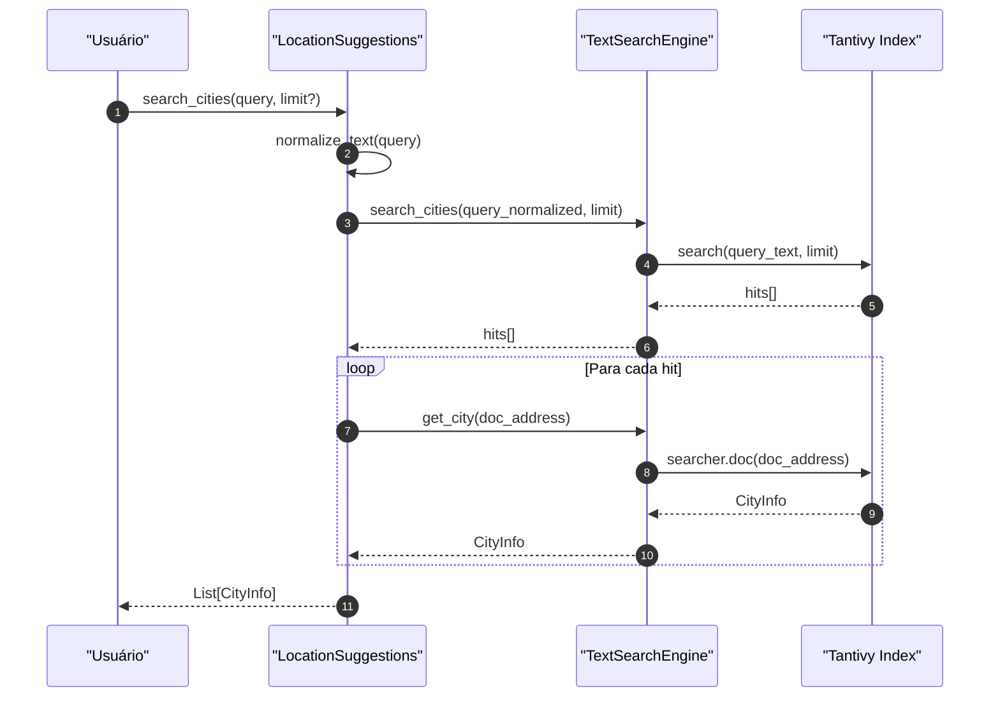
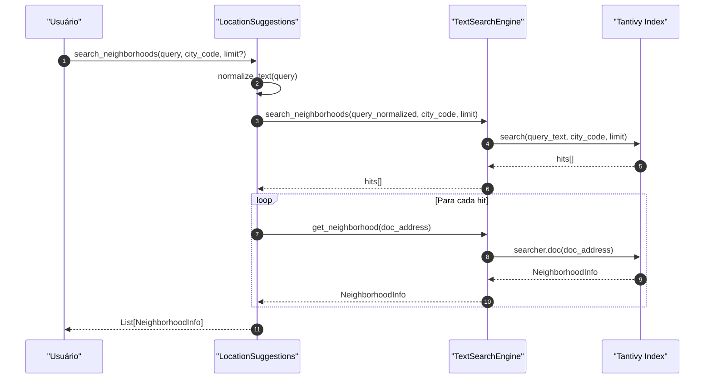
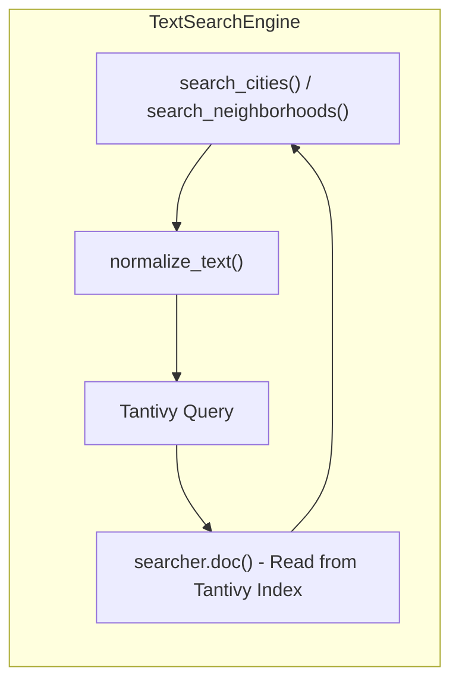

# LocationSuggestions Flow

Sequência de execução do `LocationSuggestions` para autocomplete de cidades e bairros.

## search_cities() - Fluxo

## search_neighborhoods() - Fluxo

## Arquitetura de Busca Textual

## Comparação: Geocoder vs LocationSuggestions

| Aspecto | Geocoder | LocationSuggestions |
|---------|----------|---------------------|
| **Propósito** | Geocodificar endereços para lat/lon | Autocomplete de cidades/bairros |
| **Entrada** | Endereço completo | Nome parcial |
| **Busca** | Vector search (usearch) | Text search (Tantivy) |
| **Dados** | SQLite + embeddings | Tantivy index (100%) |
| **Saída** | AddressInfo (lat, lon) | CityInfo / NeighborhoodInfo |

## Componentes Envolvidos

| Componente | Responsabilidade |
|-----------|------------------|
| `LocationSuggestions` | Orquestra busca de cidades/bairros |
| `TextSearchEngine` | Abstração sobre Tantivy index |
| `Tantivy Index` | Índice invertido para busca text |
| `normalize_text` | Normaliza texto para busca |
